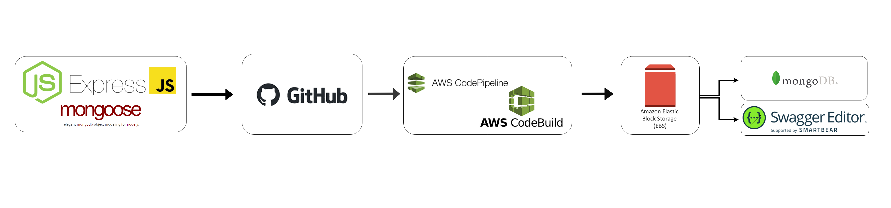

# Clutch: An Axe Throwing API

This is a RESTful API for tracking axe throwing games,scores, users, and more. This application is a Node.js web server built using the Express framework, designed to interact with a MongoDB database using the Mongoose Object Data Modeling (ODM) library. The app includes Swagger for API documentation and uses the dotenv library to load environment variables. The application leverages AWS services such as CodeBuild and CodePipeline for continuous integration and continuous deployment (CI/CD) processes. Once the application has been built and tested, it is automatically deployed to AWS Elastic Beanstalk (EBS) to host the web server and serve the Swagger documentation.

## Installation and Setup
Clone the repository to your local machine:

```git clone https://github.com/markjsapp/clutch-backend.git```

Install the required packages:

```npm install```

Create a .env file in the root directory of your project and add the following lines:

```MONGODB_URI=mongodb+srv:/{username}:{password}@clutch-backend-api.zwp2x1e.mongodb.net/?retryWrites=true&w=majority
MONGODB_USER={username}
MONGODB_PASS={password}
```

Note: Replace {username} and {password} with your actual MongoDB username and password.

Start the server: ```npm start```
The server will start running at http://localhost:3000.

## Workflow


## Dependencies Used
dotenv: This library allows the application to load environment variables from a .env file, making it easy to manage and use different configurations for development, staging, and production environments.

express: Express is a fast, unopinionated, minimalist web framework for Node.js. It is used to create the web server, handle HTTP requests, and define the routes and endpoints for the application.

mongodb: This is the official MongoDB driver for Node.js, providing a high-level API to interact with MongoDB databases. In this application, it is used in conjunction with Mongoose.

mongoose: Mongoose is an ODM library that provides a straightforward, schema-based solution for modeling your application data and interacting with MongoDB. It includes built-in type casting, validation, query building, and more.

swagger-jsdoc: This library integrates JSDoc comments with Swagger, generating OpenAPI (formerly Swagger) specification files based on JSDoc comments in the application's source code. This makes it easy to maintain API documentation as your application evolves.

swagger-ui-dist: This package provides the distribution of the Swagger UI, which is a collection of HTML, JavaScript, and CSS assets that allow you to visualize and interact with your API's resources.

swagger-ui-express: This library allows you to serve the Swagger UI using Express, making it easy to integrate the Swagger UI into your application.

## Scripts
doc: Generates API documentation using the Gulp task runner and the gulp-jsdoc3 plugin.

prestart: Executes the doc script before starting the application, ensuring that API documentation updates.

start: Starts the application by running node app.js.

## API Documentation
The API documentation is available (and always updated) [here](http://clutch-api-dev.us-east-1.elasticbeanstalk.com/). You can use Swagger UI to explore the API endpoints and interact with the API.

## License
This project is licensed under the MIT License.