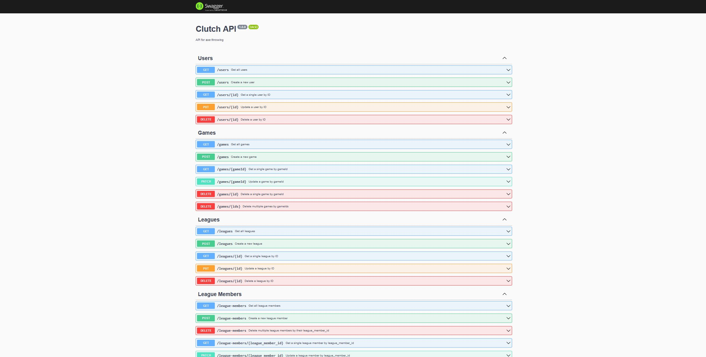

# Clutch Axe Throwing API

This is a RESTful API for tracking axe throwing games,scores, users, and more.

## Installation and Setup
Clone the repository to your local machine:

```git clone https://github.com/markjsapp/clutch-backend.git```

Install the required packages:

```npm install```

Create a .env file in the root directory of your project and add the following lines:

```MONGODB_URI=mongodb+srv:/{username}:{password}@clutch-backend-api.zwp2x1e.mongodb.net/?retryWrites=true&w=majority
MONGODB_USER={username}
MONGODB_PASS={password}
```

Note: Replace {username} and {password} with your actual MongoDB username and password.

Start the server: ```npm start```
The server will start running at http://localhost:3000.

## API Documentation

The API documentation is available at http://localhost:3000/docs. You can use Swagger UI to explore the API endpoints and interact with the API.

## API Endpoints
Endpoint information/documentation can be found [here](https://clutch-axe-api.s3.amazonaws.com/docs/index.html)

## License

This project is licensed under the MIT License.